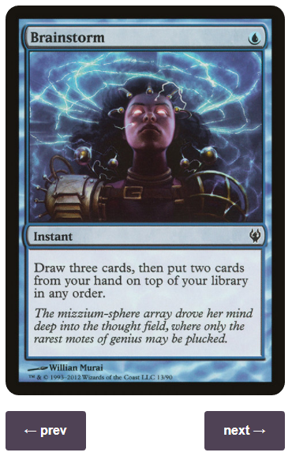

# Scryfall Tagger Enhancements

This script is a small project to make some enhancements and updates to the Scryfall tagger interface.

Right now it does one specific thing: Pagination.

# [Click here to install](https://raw.githubusercontent.com/spacemonaut/userscripts/master/scryfall-tagger-enhancements/scryfall-tagger-enhancements.user.js)

* Firefox users will need [Greasemonkey](https://addons.mozilla.org/en-GB/firefox/addon/greasemonkey/) or [Tampermonkey](https://addons.mozilla.org/en-GB/firefox/addon/tampermonkey/)
* Chrome users will need [Tampermonkey](https://chrome.google.com/webstore/detail/tampermonkey/dhdgffkkebhmkfjojejmpbldmpobfkfo?hl=en)
